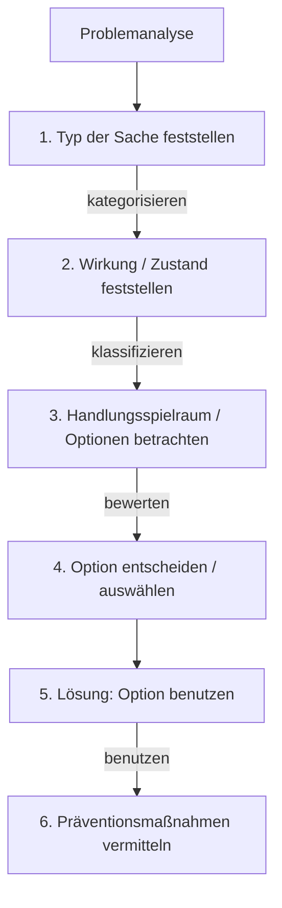

# Problemanalyse

> Textfassung der Whiteboard-Notizen.  
> Unklare Stellen aus dem Foto sind mit `TODO: prüfen` markiert.

## Ablauf

## 1. Typ der Sache feststellen

Beispiele für Kategorien:

- Möbel
- elektrisches Gerät

## 2. Wirkung / Zustand feststellen

Mögliche Zustände:

- physisch kaputt
- Funktion beeinträchtigt oder kaputt
- verbraucht
- höheres Risiko
  - Security
  - elektrische / elektronische Sicherheit
  - körperlicher Schaden / Verletzung
- Funktion in Ordnung, aber im Fehlzustand  
  `TODO: prüfen — handschriftliche Formulierung nicht vollständig eindeutig`

## 3. Handlungsspielraum / Optionen betrachten

Mögliche Optionen:

- Garantie / Gewährleistung
- Resetmaßnahmen
- reparieren
- reparieren lassen
- `[TODO: prüfen — unleserlich: „Vor… anwenden“]`
- Ersatz beschaffen
- entsorgen / Recycling
- Wartung, z. B. kalibrieren oder reinigen
- Verbrauchsmaterial ersetzen / austauschen

Mögliche Unterstützung:

- Wissende
- Werkzeuge ausleihen
- Kenntnisse / Fähigkeiten vermitteln
- Community-Angebot vermitteln
- Dienstleister
- Werkstatt
- Produkte vermitteln

## 4. Option entscheiden / auswählen

Bewertungskriterien:

- Kosten / wirtschaftlicher Wert
- Mobilität
- Aufwand / Zeit
- Wissen / Fähigkeiten / Expertise
- ideeller Wert

## 5. Lösung: Option benutzen

Die ausgewählte Option wird umgesetzt.

## 6. Präventionsmaßnahmen vermitteln

- Wartung / Pflege empfehlen
- alternative, „bessere“ oder nachhaltigere Produkte empfehlen
- Benutzerhinweise zur korrekten Verwendung geben

## Offene Punkte zur Prüfung

1. In Schritt 2 ist die Formulierung `Funktion in Ordnung, aber im Fehlzustand` aus dem Foto nicht vollständig eindeutig.
2. In Schritt 3 ist eine Option nicht sicher lesbar: `Vor… anwenden`.
